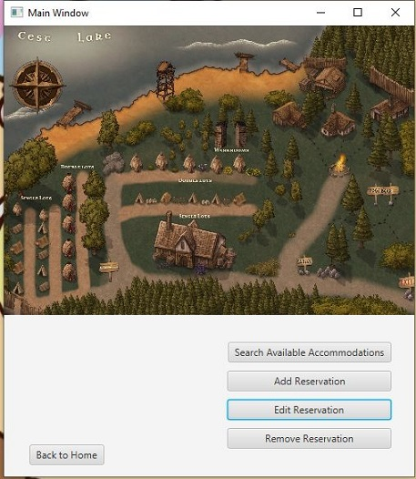
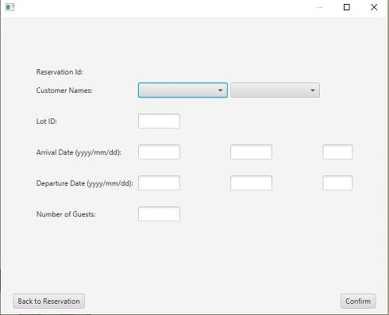
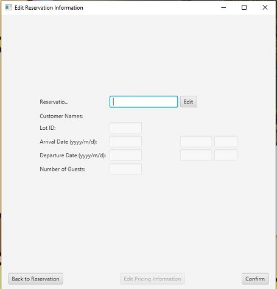
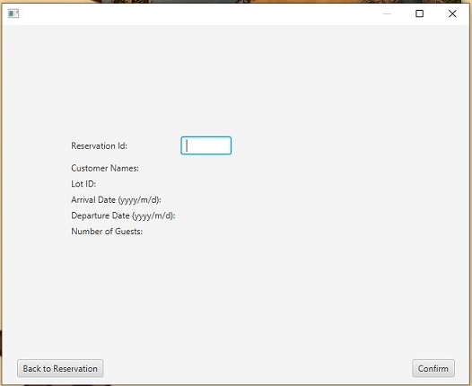

# PrjPurple-Campsite
This project was size project, done with a group of eight classmates in first year third semester. 
This demostrates my first attempt at agile programming and was done in JavaFX.

# Pieces I Contributed To
Backend - Developed the Transactions base entity class that handles creating, getting and setting transactions. 
It requires an Enumeration that handles debit, credit, and cash transaction types
Frontend - I helped developed a few areas of the GUI's for this program
    
    1.MainGUI (opening page to the programming) with highlighting the structure and interactive buttons 

     
     2. Add reservation GUI: Features you can have two people added to a reservation, alerts, error checking and form input features. 
     It takes in a selected 1 to 2 listing names, a lot id, arrival date, departure date, and number of guests. 
     It handles error checking for: 
                - Listing name: drop down menu, consisting of client names already saved to the database 
                (Group design decision: a client must already be in the database to be able to reserve a campsite)
                - Lots: if exists and is available to be reserved
                - Arrival and Departure Dates: making sure they are valid date (current dates, departure cannot
                be before the arrival date)
                - Number of guest: cannnot exceed the Lot's maximum number of guests. Must be a digit.
                - 2 Alerts: One tells the user if the reservation is overlapping another reservation. 
                Another tells you if the reservation was successfully created
                - Back to Main GUI button

      
      3.Edit Reservation: Features all the same processes as add reservation with some subtle differences. 
      Its takes in a reservation Id and has an edit 
                - Reservation id: Takes in a reservation id and provides all the inputs with the data for that reservation. 
                - Edit button: allows the blocked input feildsthe reservation to be edited
                - similar erro checking handles
                - Back to Reservation button: Back to the Add Reservation Page
                - Edit Transaction button: Part of another story

      
      4. Remove Reservation: Features a single inputs, button, and alerts
      It takes in a single Reservation with a double confirmation for removing a reservation
              - Reservation Id: Pre-fills all the fields with input from the reservation id, error checks for valid id
              - Confim Buttons: set an Alert for another confirmation to remove that specfic reservation (2 buttons ok and cancel)
              - Ok button: removes the reservation with another Alert stating the reservation was succesfully removed
              - Cancel Button: Stops the removal process
        

              
              
       
